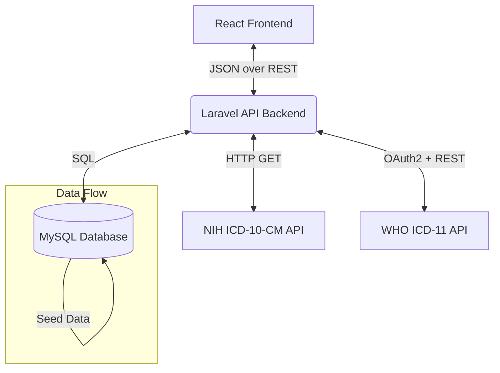

# Surgical Procedure Listing App – Extended Architecture

Building on the initial High-Level Design Overview, this document expands the technical architecture of the application, taking into account the Treatment Time Guarantees (TTGs) and clinical data structures seen in the `Master_v4 TTGs.xlsx` source data.

## 1. System Architecture Overview

The system follows a standard three-tier architecture, augmented by integrations with external clinical coding terminologies (NIH and WHO APIs).

*   **Presentation Layer (Frontend):** React.js (Single Page Application).
*   **Application Layer (Backend):** Laravel (PHP) RESTful API.
*   **Data Layer:** MySQL relational database.
*   **External Integrations:** NIH Clinical Table Search Service (ICD-10-CM), WHO ICD-11 API.

## 2. Expanded Database Schema

To accommodate the data structure defined in `Master_v4 TTGs.xlsx`, the database schema must account for clinical prioritization, Care/ICU levels, and SLAs (Treatment Time Guarantees).

### Core Tables

#### `procedures`
Stores the core surgical procedures imported from the master catalog.
*   `id` (PK, int)
*   `speciality` (varchar, e.g., 'Radiation Oncology', 'Cardiac Surgery')
*   `procedure_name` (varchar, e.g., 'Breast Cancer', 'Appendectomy')
*   `level` (varchar, e.g., 'T/C')
*   `care_icu` (varchar, nullable)
*   `ttg_months` (varchar, e.g., '3 months')
*   `ttg_days` (int, e.g., 90)
*   `ttg_minimum_70_pct` (int, e.g., 63) - *Trigger for 1st Alert SLA*
*   `ttg_alert_90_pct` (int, e.g., 81) - *Trigger for 2nd Alert SLA*

#### `icd_codes`
Centralized dictionary for both ICD-10-CM and ICD-11 codes.
*   `id` (PK, int)
*   `version` (enum: 'ICD-10', 'ICD-11')
*   `code` (varchar, e.g., 'C50.9', '2C6Z')
*   `description` (text)

#### `procedure_icd_mappings`
Junction table linking procedures to their respective ICD codes, allowing for many-to-many relationships (since one procedure can map to multiple codes, and vice versa).
*   `procedure_id` (FK to procedures.id)
*   `icd_code_id` (FK to icd_codes.id)
*   `mapping_type` (enum: 'Primary', 'Secondary', 'Equivalent')

## 3. Application Workflow & SLAs

A significant addition derived from the Master TTGs document is the concept of **Treatment Time Guarantees (TTGs)**. The application architecture must support these SLA metrics:

1.  **Search & Discovery:** When a clinician queries a `procedure_name` (e.g., "Breast Cancer"), the system queries the `procedures` table.
2.  **Code Fetching:** The Laravel backend simultaneously queries the local `procedure_icd_mappings` and the external WHO/NIH APIs to return the exact ICD-10 and ICD-11 code mappings.
3.  **SLA Visualization:** The frontend will display the TTG metrics alongside the procedure and codes. 
    *   **Visual Indicators:** If the application is ever expanded to track actual patients on a waiting list, the `ttg_minimum_70_pct` and `ttg_alert_90_pct` integer days will be used to conditionally format the UI (e.g., Yellow at 70% threshold, Red at 90% threshold).

## 4. Technical Stack Considerations

### Frontend
*   **Framework:** React (Vite for fast tooling).
*   **UI Library:** TailwindCSS for rapid, responsive styling.
*   **State Management:** React Query (for handling caching, API fetching, and synchronization of the asynchronous NIH/WHO API calls).

### Backend
*   **Framework:** Laravel 11.
*   **API Management:** Laravel HTTP client for concurrent requests to NIH and WHO APIs.
*   **Caching:** Redis (recommended) to cache WHO API tokens (which expire hourly) and frequently searched procedures to minimize external API roundtrips.

### Security
*   WHO API OAuth2 tokens strictly handled by the Laravel backend, never exposed to the React frontend.
*   Cross-Origin Resource Sharing (CORS) strictly configured in Laravel to only accept traffic from the React app's domain.
